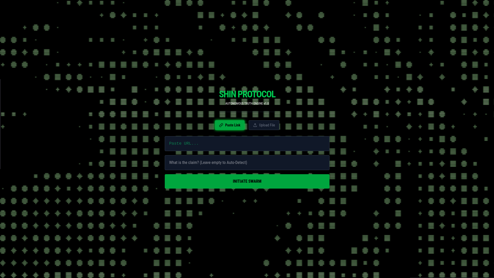

# SHIN PROTOCOL (真)

> An autonomous AI swarm for detecting misinformation across multi-modal media (Text, Images, Video).

!

## ⚡ Core Capabilities

* **Multi-Modal Analysis:** Capable of analyzing static images, text claims, and short-form video (YouTube Shorts, Instagram Reels, TikTok).
* **Swarm Intelligence:** Orchestrates multiple AI agents (Search, Vision, VideoOps, Judge) to cross-reference data in real-time.
* **Dual-Search Strategy:** Cross-checks claims against both specific "Fact Checks" and broad "Latest News" to catch emerging rumors.
* **Resilient Architecture:** Features a self-healing backend that handles API failures and social media scraping blocks gracefully.

## 🛠️ Tech Stack

* **Frontend:** React.js, TailwindCSS, Framer Motion (Cyberpunk Terminal UI)
* **Backend:** Python (Flask), LangChain
* **AI Models:** Google Gemini 2.5 Flash
* **Tools:** `yt-dlp` (Video Extraction), `DuckDuckGo` (Live Search), `OpenAI Whisper` (Transcription fallback)

## 🚀 How It Works

1.  **Input:** User pastes a link (e.g., a YouTube Short claiming a politician died).
2.  **Extraction:** The `VideoAgent` extracts metadata and transcripts.
3.  **Search:** The `SearchAgent` performs parallel queries for "Fact Checks" and "Live News".
4.  **Deliberation:** The `JudgeAgent` synthesizes the evidence.
5.  **Verdict:** The UI renders a "Fake News" reel overlay with a confidence score and sources.

## 📦 Setup

```bash
# Backend
cd backend
pip install -r requirements.txt
python app.py

# Frontend
cd frontend
npm install
npm run dev